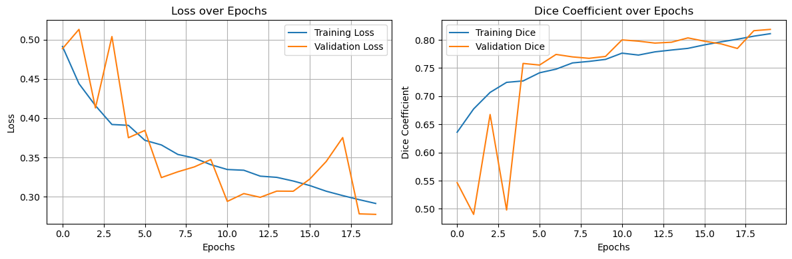
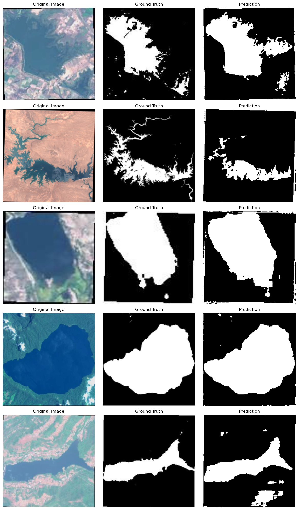

# Satellite Water Body Segmentation: U-Net with PyTorch


Segmenting water bodies from satellite images using a U-Net implemented in PyTorch.

## The Gist

This project covers the end-to-end process for semantic segmentation of water bodies:

*   **Data Handling:** Custom PyTorch `Dataset` loads images/masks, applies transforms (Resize 256x256, ToTensor).
*   **Dataset Split:** Standard Train (70%) / Validation (15%) / Test (15%).
*   **Model:** U-Net architecture built from scratch (`nn.Module`).
*   **Training:** Standard loop with `BCEWithLogitsLoss`, Adam optimizer, Dice Coefficient tracking, validation, best model saving (`.pt`), early stopping.
*   **Evaluation:** Test set performance measured via Loss and Dice score.
*   **Visualization:** Training curves and prediction examples.

## Results Snapshot

### Training Curves


*(Training ran for 20 epochs, batch size 16. Best model saved based on validation Dice)*

### Test Set Performance

The best model (selected via validation Dice) achieved:

*   **Test Loss:** **0.3093**
*   **Test Dice Coefficient:** **0.8092**

### Visual Predictions


*(Left: Original Image, Middle: Ground Truth Mask, Right: Model Prediction)*

## Code Highlights

Key components of the implementation:

**1. U-Net Architecture (`__init__`)**
```python
class UNet(nn.Module):
    def __init__(self, in_channels=3, out_channels=1, features=[64, 128, 256, 512]):
        super(UNet, self).__init__()
        self.downs = nn.ModuleList()
        self.ups = nn.ModuleList()
        self.pool = nn.MaxPool2d(kernel_size=2, stride=2)

        # Encoder Path (Downsampling)
        for feature in features:
            self.downs.append(DoubleConv(in_channels, feature))
            in_channels = feature

        # Bottleneck
        self.bottleneck = DoubleConv(features[-1], features[-1] * 2)

        # Decoder Path (Upsampling)
        for feature in reversed(features):
            # Up-convolution
            self.ups.append(
                nn.ConvTranspose2d(feature * 2, feature, kernel_size=2, stride=2)
            )
            # DoubleConv after concatenation
            self.ups.append(DoubleConv(feature * 2, feature)) # Takes concatenated channels

        # Final Convolution
        self.final_conv = nn.Conv2d(features[0], out_channels, kernel_size=1)
```

**2. U-Net Core Block (`DoubleConv`)**
```python
class DoubleConv(nn.Module):
    def __init__(self, in_channels, out_channels):
        super(DoubleConv, self).__init__()
        self.double_conv = nn.Sequential(
            nn.Conv2d(in_channels, out_channels, kernel_size=3, padding=1),
            nn.BatchNorm2d(out_channels),
            nn.ReLU(inplace=True),
            nn.Conv2d(out_channels, out_channels, kernel_size=3, padding=1),
            nn.BatchNorm2d(out_channels),
            nn.ReLU(inplace=True)
        )
    def forward(self, x):
        return self.double_conv(x)
```

**3. U-Net Decoder Step Logic (Inside `UNet.forward`)**
```python
# Assumes 'x' is output from previous layer, 'skip_connections' holds encoder outputs
for i in range(0, len(self.ups), 2):
    x = self.ups[i](x) 
    skip_connection = skip_connections[i // 2] 


    concatenate_skip = torch.cat((skip_connection, x), dim=1) 
    x = self.ups[i + 1](concatenate_skip) 
```

**4. Custom Dataset (`__getitem__`)**
```python
# In WaterBodyDataset class:
def __getitem__(self, idx):
    image = Image.open(img_path).convert("RGB")
    mask = Image.open(mask_path).convert("L") # Grayscale mask

    if self.transform:
        image = self.transform(image)
        mask = self.transform(mask)
    return image, mask
```

**5. Dice Coefficient Metric**
```python
def dice_coefficient(pred, target, smooth=1e-6):
    pred_flat = pred.view(-1)
    target_flat = target.view(-1)
    intersection = (pred_flat * target_flat).sum()
    return (2. * intersection + smooth) / (pred_flat.sum() + target_flat.sum() + smooth)
```

## Dataset

*   **Source:** [Satellite Images of Water Bodies](https://www.kaggle.com/datasets/franciscoescobar/satellite-images-of-water-bodies) on Kaggle.

## Tech Stack

*   Python 3.8+
*   PyTorch & Torchvision
*   NumPy
*   Matplotlib
*   Pillow (PIL)
*   Scikit-learn (`train_test_split`)
*   tqdm (Used for progress bars during training/evaluation, but didnot work for me the last time i ran for some reason)
## Potential Next Steps

*   More sophisticated data augmentation.
*   Maybe try different segmentation architectures (DeepLabv3+, etc.).
*   Experiment with different loss functions (Focal Loss, Lovasz Hinge).
*   Using a pre-trained encoder (transfer learning).

## License

MIT License
